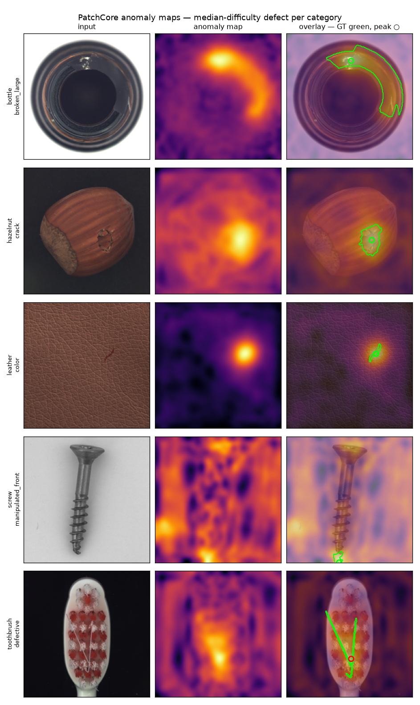
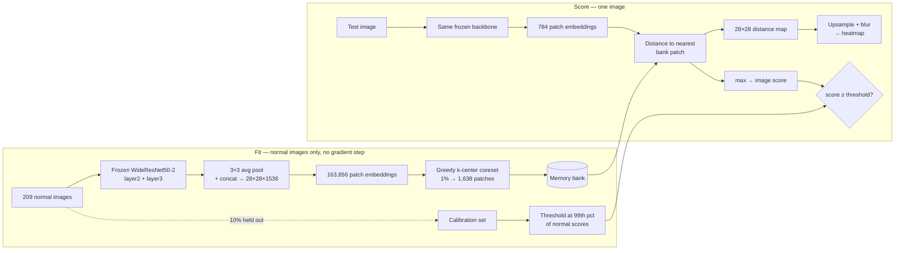
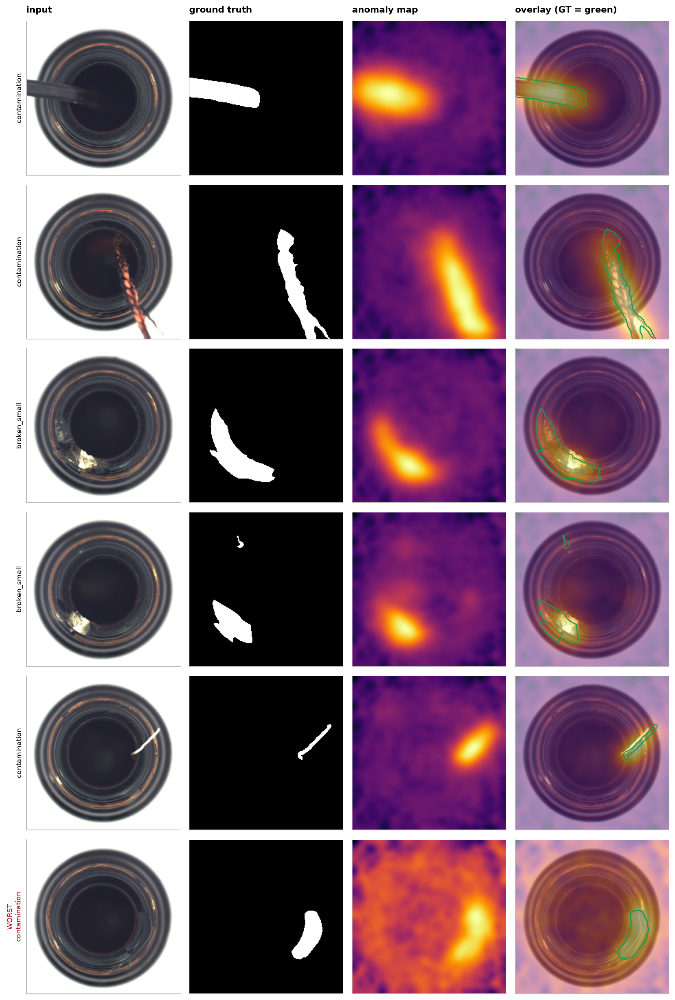

# Explainable Visual Defect Detector

Industrial visual inspection that flags defective parts **and shows where the defect is** —
built from normal examples only. No defect was ever labelled for training.

Reproduces PatchCore (Roth et al., CVPR 2022) from the paper on all 15 MVTec AD categories:
**mean image AUROC 0.9874 vs the paper's 0.990**, on a laptop, in about 10 minutes total.

The more interesting result is what happens when you *measure* the explanations instead of
looking at them. A supervised classifier on `screw` reaches **0.959 AUROC** while its Grad-CAM
heatmap lands on the actual defect **0% of the time** — right answers, demonstrably wrong
reasons. Details in [Explanations, verified](#explanations-verified-milestone-4).



*Median-difficulty defect per category — not the best cases. Green is ground truth, the
circle is the map's hottest pixel. `bottle`, `hazelnut` and `leather` are clean hits;
`screw` is the failure mode this project measures rather than crops out: the map is diffuse
and its peak sits nowhere near the tiny labelled defect at the tip.*

---

## Contents

- [What it does](#what-it-does) · [Architecture](#architecture) · [Results](#results-full-15-category-benchmark)
- [Explanations, verified](#explanations-verified-milestone-4) · [Classifier + Grad-CAM comparison](#does-a-supervised-classifier-do-better-milestone-4b)
- [From benchmark to shipped](#from-benchmark-to-shipped-milestone-5) · [Ablations](#ablations)
- [A data bug worth documenting](#a-data-bug-worth-documenting) · [Reproduce](#reproduce) · [What I'd try next](#what-id-try-next)

---

## What it does

In real inspection, defects are rare, varied, and expensive to label; normal parts are
abundant. So the deployable framing is *learn what normal looks like, flag deviations* — not
*collect 500 examples of every defect you hope to see.*

MVTec AD enforces exactly this. `train/` contains **only** normal images; every defect lives
in `test/`. Training a supervised classifier here means moving defects out of the test set,
contaminating the only clean evaluation split the benchmark has.

| split | class | n (`bottle`) |
|---|---|---|
| train | good | 209 |
| test | good | 20 |
| test | broken_large / broken_small / contamination | 20 / 22 / 21 |

**Zero defective images in `train`.** That single fact drives every design decision below.

## Architecture



Nothing is trained. The backbone is frozen ImageNet; the "model" is a set of remembered
normal patches. That is why a category fits in ~25 s on CPU-class hardware.

## Results: full 15-category benchmark

PatchCore, 1% coreset, paper preprocessing, frozen WideResNet50-2.
Full table with pixel metrics and random-map controls: [`reports/benchmark.md`](reports/benchmark.md).

| category | image AUROC | paper | Δ | AUPRO | peak-in-mask |
|---|---|---|---|---|---|
| bottle | 1.0000 | 1.000 | +0.000 | 0.8828 | 0.984 |
| cable | 0.9983 | 0.993 | +0.005 | 0.8698 | 0.924 |
| capsule | 0.9773 | 0.980 | −0.003 | 0.8783 | 0.688 |
| carpet | 0.9904 | 0.987 | +0.003 | 0.8819 | 0.809 |
| grid | 0.9699 | 0.981 | −0.011 | 0.8380 | 0.632 |
| hazelnut | 1.0000 | 1.000 | +0.000 | 0.8132 | 0.857 |
| leather | 1.0000 | 1.000 | +0.000 | 0.9164 | 0.891 |
| metal_nut | 0.9990 | 0.998 | +0.001 | 0.8824 | 0.946 |
| pill | 0.9569 | 0.966 | −0.009 | 0.8939 | 0.695 |
| screw | 0.9412 | 0.981 | −0.040 | 0.8231 | 0.496 |
| tile | 0.9917 | 0.987 | +0.005 | 0.7214 | 0.905 |
| toothbrush | 1.0000 | 1.000 | +0.000 | 0.7543 | 0.567 |
| transistor | 1.0000 | 1.000 | +0.000 | 0.8613 | 0.950 |
| wood | 0.9895 | 0.992 | −0.003 | 0.7722 | 0.900 |
| zipper | 0.9968 | 0.985 | +0.012 | 0.8967 | 0.966 |
| **mean** | **0.9874** | 0.990 | **−0.0026** | **0.8457** | **0.814** |

Two independent full runs of this pipeline agreed on all 60 metric values across the 15
categories to within 1e-6, so these numbers are reproducible rather than a lucky seed.

Twelve of fifteen land within a point of the paper. `screw` is 4 points short and is reported
as such — the likeliest cause is the score reweighting deliberately omitted (see
[Deviations](#deviations-from-the-paper)).

### Baseline → PatchCore

Milestone 2 was a deliberately naive detector: ResNet18, global average pool, nearest-neighbour
distance. It exists to make the improvement measurable rather than assumed.

| category | kNN baseline | PatchCore | Δ |
|---|---|---|---|
| bottle | 0.9937 | **1.0000** | +0.006 |
| pill | 0.7534 | **0.9569** | +0.204 |
| screw | 0.7639 | **0.9412** | +0.177 |

The baseline was near-useless exactly where it mattered — on `screw` it scored 78.8% accuracy
against a 74.4% majority-class baseline, about 4 points of real signal. Global average pooling
averages a small defect into nothing, and destroys the spatial map needed to localise at all.

## Explanations, verified (Milestone 4)

A heatmap that lights up in the wrong place is worse than no heatmap, because it looks like
evidence. MVTec ships pixel-level ground truth, so this is measurable. Four metrics, each
catching what the others miss, **each paired with a random-map control on the same images**:

| metric | what it answers | why alone it misleads |
|---|---|---|
| pixel AUROC | ranking over all pixels | dominated by easy background; stays high when the map is bad |
| AUPRO | per-defect-region overlap to 30% FPR | the standard MVTec localisation metric |
| peak-in-mask | does the hottest pixel land in the defect? | what a human actually reads off a heatmap |
| top-1% precision | of the 1% hottest pixels, how many are defect? | punishes diffuse maps that cover everything |

**The control is the point.** Without it, "0.9686 pixel AUROC on `screw`" is unfalsifiable.
With it:

| `screw` | model | random map |
|---|---|---|
| pixel AUROC | 0.9686 | 0.503 |
| AUPRO | 0.8231 | 0.133 |
| **peak-in-mask** | **0.4958** | 0.000 |
| top-1% precision | 0.2653 | 0.004 |

Pixel AUROC says 0.97 — excellent. Peak-in-mask says the hottest pixel misses the defect
**half the time**. Both are true. `screw` defects cover 0.43% of the image, so a map can score
0.97 by being confidently right about background. Reporting only pixel AUROC would have been
technically accurate and practically dishonest.

Across all 15 categories, peak-in-mask ranges from 0.496 (`screw`) to 0.984 (`bottle`) while
pixel AUROC stays in a narrow 0.92–0.99 band. **There is no single honest number for
"explainability" here**, which is why the app says so in its own UI.



## Does a supervised classifier do better? (Milestone 4b)

Grad-CAM needs a classifier to backpropagate through, and PatchCore has none. So the
comparison is built properly rather than skipped:

- `test/` is split **once**, stratified by defect type, fixed seed, split written to disk
- the classifier trains on half the test defects **plus** the normal train split
- it is evaluated on the other half, which it never sees
- PatchCore is re-scored on **exactly those same held-out images**

The comparison is deliberately unfair in the classifier's favour — it is shown real defects,
PatchCore never sees one.

| held-out | detection AUROC | | Grad-CAM vs anomaly map | | | |
|---|---|---|---|---|---|---|
| | **classifier** | **PatchCore** | peak-in-mask (CAM / map) | pixel AUROC (CAM / map) | AUPRO (CAM / map) | |
| bottle | 1.0000 | 1.0000 | 0.688 / **0.969** | 0.895 / **0.982** | 0.685 / **0.902** | |
| pill | 0.9526 | 0.9579 | 0.356 / **0.671** | 0.827 / **0.970** | 0.656 / **0.900** | |
| screw | **0.9586** | 0.9375 | **0.000** / 0.492 | **0.578** / 0.970 | 0.205 / **0.841** | |

**The `screw` row is the whole argument.** The classifier *wins on detection* — 0.959 vs
0.938 — and its explanation is worthless: pixel AUROC 0.578 is barely above chance, and the
hottest CAM pixel lands inside the defect in **0 of 61** images. It learned something that
separates the classes without being the defect, and Grad-CAM faithfully points at that
something.

A model that is right for the wrong reasons passes every metric an image classifier is
usually judged on. You only catch it by measuring the explanation. That is the case for
anomaly detection here, made on evidence rather than assertion.

## From benchmark to shipped (Milestone 5)

AUROC needs no threshold. Shipping does — and picking the threshold that maximised F1 on the
test set would calibrate the demo on its own exam.

Instead: hold out 10% of the **normal** training images, keep them out of the memory bank,
and set the threshold at the 99th percentile of their scores. Only normal data — exactly what
a factory has on day one. Then check that prediction against the real test split:

| category | threshold | target FPR | realised FPR | recall |
|---|---|---|---|---|
| bottle | 2.018 | 1% | **0.0%** (0/20) | **100%** |
| pill | 2.114 | 1% | **7.7%** (2/26) | 81.6% |
| screw | 1.996 | 1% | **0.0%** (0/41) | **53.8%** |

Neither `pill` nor `screw` hits the target, in opposite directions, and both are instructive:

- **`pill` overshoots** — 7.7% false alarms against a 1% target. The threshold is a 99th
  percentile estimated from **27 calibration images**. Estimating a 1-in-100 quantile from 27
  samples is statistically hopeless; it is essentially the maximum of a small sample.
- **`screw` undershoots badly** — a benchmark AUROC of 0.941 collapses to **53.8% recall** at
  a deployable operating point. Nearly half the defective screws ship.

This is the gap between a leaderboard number and a working system, and it only becomes
visible if you calibrate honestly and then check. `verify_threshold.py` exists to make that
check impossible to skip.

### The demo

```bash
uv run streamlit run app.py     # or: docker build -t defect-detector . && docker run -p 7860:7860 defect-detector
```

Deployment steps, including the public Hugging Face Space: [DEPLOY.md](DEPLOY.md).

The app deliberately colours the heatmap on an **absolute** scale anchored to the threshold.
Per-image min–max normalisation is the intuitive choice and it is wrong: it stretches whatever
range an image has to full brightness, so a perfectly clean part renders as a blaze of orange
and the demo contradicts its own verdict.

## Ablations

**Coreset selection is load-bearing.** Same bank size on `screw`:

| sampling | bank | image AUROC |
|---|---|---|
| random 1% | 2,508 | 0.5518 |
| **greedy k-center 1%** | 2,508 | **0.8737** |

Random sampling collapses to chance. The image score is a *max* over patch distances, so it is
hostage to coverage: random sampling misses rare-but-normal patches, they read as distant, and
normal images get flagged. Pixel AUROC barely moved across that collapse (0.961 vs 0.964) —
two metrics, opposite conclusions, again.

**Bank size gives diminishing returns; preprocessing beat all of it** (`screw`, resize-only):

| config | bank | image AUROC | runtime |
|---|---|---|---|
| 1% coreset | 2,508 | 0.8737 | 44 s |
| 5% coreset | 12,544 | 0.9182 | 179 s |
| 10% coreset | 25,088 | 0.9289 | 343 s |
| **1% + paper preprocessing** | 2,508 | **0.9412** | **45 s** |

`CenterCrop` magnifies a centred object, and `screw` defects are tiny — better than a 10×
bigger bank at one-seventh the compute. This contradicts the resize-only choice I had
justified by measurement on `bottle`, where cropping clipped defect area in 4/63 images. The
right preprocessing is category-dependent; both are reported rather than picked per category,
which would be tuning on the test set.

## A data bug worth documenting

The official mvtec.com download link is dead (404), so data comes from the Voxel51 HuggingFace
mirror. That mirror flattens every image into shared shards and appends a dedup suffix — and
**the suffix differs between an image and its own mask**: `000-94.png` vs `000_mask-67.png`.
Pairing by filename yields **zero** masks, silently. A pipeline built on that would report
image-level metrics while claiming pixel-level localisation.

`fetch_mvtec.py` strips the suffix and asserts every anomalous test image has a matching mask,
failing the fetch otherwise. Verified across all 15 categories.

## Decisions made on measurement, not convention

- **Input size 224.** The smallest `bottle` defect covers 0.58% of pixels ≈ 289 px at 224²,
  still resolvable. Chosen from mask statistics.
- **AUROC / AP over accuracy.** Test splits run 60–84% anomalous; accuracy rewards a constant
  prediction. Median defect covers 5.7% of pixels, so *pixel* accuracy is worse — an
  all-negative mask scores 92.4%.
- **Reflect padding in the map blur.** Zero padding pulls the blurred map down at the border,
  systematically under-scoring edge defects.
- **`zip(..., strict=True)`** wherever paired arrays are combined, so a length mismatch is an
  error rather than a silent truncation that misaligns scores from labels.

## Deviations from the paper

- **Image score is a plain max** over patch distances; the paper reweights it by how isolated
  the matched bank point is. Most likely source of the remaining `screw` gap.
- **Greedy k-center runs in a 128-d Johnson–Lindenstrauss projection** (as the paper does);
  the bank keeps full 1536-d vectors.
- **No test-set tuning.** MVTec ships no validation split. The headline is fixed to the
  paper's protocol; everything else is reported as an ablation, not selected as a result.
- **Pixel metrics are computed on anomalous images only**, which is stricter than including
  all-normal images, and not directly comparable across preprocessing variants.

## Reproduce

```bash
uv sync
python src/edd/fetch_mvtec.py                  # list all 15 categories
python src/edd/fetch_mvtec.py bottle           # download + validate mask pairing

uv run python src/edd/eda.py bottle            # -> reports/eda_bottle.{md,png}
uv run python src/edd/baseline.py bottle       # milestone 2 baseline
uv run python src/edd/patchcore.py bottle --crop
uv run python src/edd/explain.py bottle        # localisation metrics + controls
uv run python src/edd/classifier.py bottle     # supervised + Grad-CAM comparison
uv run python src/edd/benchmark.py             # all 15 -> reports/benchmark.md

uv run python src/edd/export.py bottle         # -> models/bottle.pt
uv run python src/edd/verify_threshold.py      # shipped threshold vs reality
uv run streamlit run app.py
```

Self-checks (also run in CI, no dataset needed) — each asserts a metric **fails** on a
deliberately wrong input:

```bash
uv run python src/edd/baseline.py --self-check
uv run python src/edd/patchcore.py --self-check
uv run python src/edd/explain.py --self-check
```

Images are not committed (~150 MB/category); `fetch_mvtec.py` rebuilds the canonical MVTec
layout from the tracked index.

## Roadmap

- [x] **1 — Data.** Fetch, layout reconstruction, mask-pairing validation, EDA.
- [x] **2 — Baseline.** Frozen ResNet18 + kNN, no training loop.
- [x] **3 — PatchCore.** Patch features, greedy k-center coreset, ablations.
- [x] **4 — Explainability.** AUPRO / peak-in-mask / top-1% with random controls; Grad-CAM comparison.
- [x] **5 — Deployment.** Calibrated threshold, Streamlit, Docker, CI.
- [x] **6 — Docs.** Full 15-category run, architecture diagram, this README.

## What I'd try next

Ordered by expected value, not by ease:

1. **Close the `screw` gap properly** by implementing the paper's score reweighting, and
   verify it is the cause rather than assuming. It is the one known deviation with a measurable
   cost.
2. **Fix the calibration sample-size problem.** Estimating a 1% quantile from 27 images is the
   root cause of `pill`'s 7.7% false-alarm rate. Options: augment the calibration set, fit a
   parametric tail instead of an empirical quantile, or report a confidence interval on the
   threshold and refuse to ship a point estimate.
3. **Report recall at a fixed false-alarm budget** as the headline metric instead of AUROC.
   `screw` at 0.941 AUROC but 53.8% recall is the number a factory would care about, and it is
   the one the benchmark culture hides.
4. **Rotation invariance for `screw`.** Its objects appear at arbitrary angles, so the bank
   spends its budget covering poses rather than defects — consistent with why a bigger bank
   helped there and nowhere else.
5. **Self-collected data.** The pipeline is dataset-agnostic; the honest test of everything
   above is a set photographed under uncontrolled lighting, where the exposure confound this
   dataset lacks (grey-level gap 1.2) would actually appear.

## Stack

PyTorch (MPS/CPU), torchvision, scikit-learn, SciPy, NumPy, Pillow, matplotlib, Streamlit,
Docker. Managed with `uv`; linted with `ruff`; CI on GitHub Actions.

## Data & licence

[MVTec AD](https://www.mvtec.com/company/research/datasets/mvtec-ad) — CC BY-NC-SA 4.0,
research/non-commercial use. Code in this repo is MIT.
