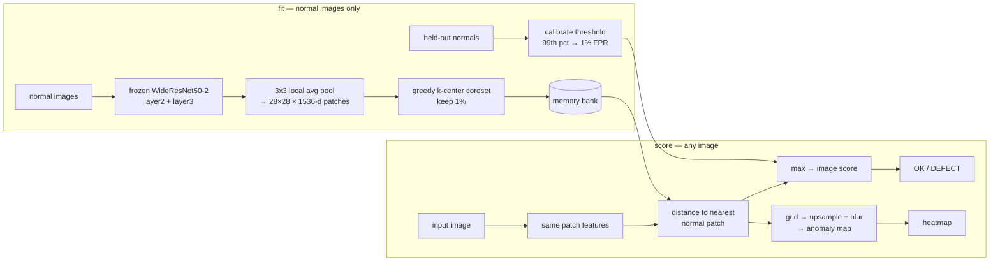

# Explainable Visual Defect Detector

Industrial visual inspection by **anomaly detection**: flag defective parts from a
photo and show *where* the defect is — built from normal examples only, with no
defect ever labelled for training.


**Mean image AUROC 0.9874 across all 15 MVTec AD categories** (published PatchCore:
0.990), with pixel-level localisation verified against ground-truth masks and a
random-map control.

[](https://github.com/aghasalim/explainable-defect-detector/actions/workflows/ci.yml)

> **Status:** benchmark, explainability and app are complete and reproducible.
> **The hosted demo is not deployed yet** — the Streamlit app runs locally
> (`uv run streamlit run app.py`) and the Space is one command away
> ([see below](#deploy-the-demo)), but there is no public link yet.
> The Docker image is written but has not been built and run end to end.

---

## Why anomaly detection, not a defect classifier

In real inspection, defects are rare, diverse, and expensive to label; normal parts
are abundant. The deployable framing is *learn what normal looks like, flag
deviations* — not *collect 500 examples of every defect you hope to see.*

MVTec AD enforces this: `train/` contains **only** normal images. Training a
supervised classifier requires moving defects out of `test/`, contaminating the only
clean evaluation split the benchmark has. That constraint drove the whole design.

## Architecture



No training loop, no gradient step: the backbone is frozen and the only learned state
is a bank of memorised normal patches. A category fits and scores in 6–108 s on a
laptop GPU.

## Results

Full benchmark, headline config (1% coreset, `Resize(256)+CenterCrop(224)`).
Reference: Roth et al., *Towards Total Recall in Industrial Anomaly Detection*, CVPR 2022.

| category | image AUROC | paper | Δ | pixel AUROC | paper | Δ | AUPRO | peak-in-mask |
|---|---|---|---|---|---|---|---|---|
| bottle | 1.0000 | 1.000 | +0.000 | 0.9770 | 0.986 | −0.009 | 0.8828 | 0.9841 |
| cable | 0.9983 | 0.993 | +0.005 | 0.9750 | 0.984 | −0.009 | 0.8698 | 0.9239 |
| capsule | 0.9773 | 0.980 | −0.003 | 0.9836 | 0.988 | −0.004 | 0.8783 | 0.6881 |
| carpet | 0.9904 | 0.987 | +0.003 | 0.9845 | 0.990 | −0.006 | 0.8819 | 0.8090 |
| grid | 0.9699 | 0.981 | −0.011 | 0.9620 | 0.987 | −0.025 | 0.8380 | 0.6316 |
| hazelnut | 1.0000 | 1.000 | +0.000 | 0.9758 | 0.987 | −0.011 | 0.8132 | 0.8571 |
| leather | 1.0000 | 1.000 | +0.000 | 0.9874 | 0.993 | −0.006 | 0.9164 | 0.8913 |
| metal_nut | 0.9990 | 0.998 | +0.001 | 0.9815 | 0.984 | −0.002 | 0.8824 | 0.9462 |
| pill | 0.9569 | 0.966 | −0.009 | 0.9722 | 0.976 | −0.004 | 0.8939 | 0.6950 |
| screw | 0.9412 | 0.981 | −0.040 | 0.9686 | 0.994 | −0.025 | 0.8231 | 0.4958 |
| tile | 0.9917 | 0.987 | +0.005 | 0.9372 | 0.959 | −0.022 | 0.7214 | 0.9048 |
| toothbrush | 1.0000 | 1.000 | +0.000 | 0.9784 | 0.987 | −0.009 | 0.7543 | 0.5667 |
| transistor | 1.0000 | 1.000 | +0.000 | 0.9407 | 0.964 | −0.023 | 0.8613 | 0.9500 |
| wood | 0.9895 | 0.992 | −0.003 | 0.9230 | 0.951 | −0.028 | 0.7722 | 0.9000 |
| zipper | 0.9968 | 0.985 | +0.012 | 0.9784 | 0.989 | −0.011 | 0.8967 | 0.9664 |
| **mean** | **0.9874** | 0.990 | −0.003 | **0.9684** | 0.981 | −0.013 | **0.8457** | **0.8140** |

Weakest: `screw` (0.941), `pill` (0.957), `grid` (0.970). All 15 are reported — the
easy ones do not get to stand in for the hard ones. Full tables in
[reports/results.md](reports/results.md), regenerated by `src/edd/report.py`.

### Detection is not explanation

`toothbrush` scores a perfect 1.0000 image AUROC while its heatmap's hottest pixel
lands inside the labelled defect only **56.7%** of the time. `screw` detects at 0.941
and localises at **49.6%**. A model can be reliably right about *whether* something is
wrong while being unreliable about *where* — which is the entire reason this project
measures localisation separately instead of showing a heatmap and calling it explained.

Every localisation metric is reported against a **random-map control** on the same
images (e.g. `screw`: 0.4958 vs 0.0000 random). Without the control, "0.97 pixel
AUROC" is unfalsifiable.

### Anomaly detection vs. supervised classification + Grad-CAM

Both evaluated on the **same held-out half** of the test split. The classifier trained
on the other half plus the normal train split; PatchCore saw no defect at all.

| category | classifier AUROC | PatchCore AUROC | Grad-CAM peak-in-mask | PatchCore peak-in-mask |
|---|---|---|---|---|
| bottle | 1.0000 | 1.0000 | 0.6875 | **0.9688** |
| pill | 0.9526 | 0.9579 | 0.3562 | **0.6712** |
| screw | **0.9586** | 0.9375 | 0.0000 | **0.4918** |

The supervised model is competitive at detecting and far worse at explaining. On
`screw` it reaches 0.96 AUROC while its Grad-CAM lands in the defect **0% of the
time** and scores 0.58 pixel AUROC — near chance. It is right for reasons unrelated
to the defect. That is precisely the failure an explainability layer exists to catch,
and it is invisible if you only report AUROC.

### Ablations

Coreset selection is load-bearing — at identical bank size on `screw`:

| sampling | bank | image AUROC |
|---|---|---|
| random 1% | 2,508 | 0.5518 |
| **greedy k-center 1%** | 2,508 | **0.8737** |

Random sampling collapses to near-chance. The image score is a *max* over patch
distances, so it is hostage to coverage: random sampling misses rare-but-normal
patches, they score as distant, and normal images get flagged. Pixel AUROC barely
moves across that collapse (0.9607 vs 0.9642) — two metrics, opposite conclusions.

Bank size gives real but sharply diminishing returns, and **preprocessing beat all of
it**: `screw` with the paper's centre-crop scores 0.9412 at 1% in 45 s, better than a
10% coreset (0.9289, 343 s) at one-seventh the compute.

| knob | setting | screw image AUROC | runtime |
|---|---|---|---|
| coreset | 1% | 0.8737 | 44 s |
| coreset | 5% | 0.9182 | 179 s |
| coreset | 10% | 0.9289 | 343 s |
| **preprocessing** | **centre-crop, 1%** | **0.9412** | **45 s** |

## From benchmark to demo: where does the threshold come from?

A benchmark reports AUROC; a demo must answer OK or DEFECT, which needs a cut-off.
Taking it from the test set would be leakage dressed as a product decision. Instead a
slice of **normal** training images is held out of the bank and the threshold is set
at their 99th score percentile — a 1% false-alarm target that never sees a defect.

Then it is checked against reality:

| category | target FPR | realised FPR on test | recall |
|---|---|---|---|
| bottle | 1% | 0.0% (0/20) | 100.0% |
| pill | 1% | **7.7%** (2/26) | 81.6% |
| screw | 1% | 0.0% (0/41) | **53.8%** |

Calibration is noisy at this sample size: a 99th percentile from ~20–40 images is
essentially the maximum, so `pill` overshoots its false-alarm target sevenfold while
`screw` is so conservative it misses half the defects. Reported as a limitation, not
tuned away against test data.

## Decisions made on measurement, not convention

- **Preprocessing, measured then revised.** `Resize(256)+CenterCrop(224)` discards the
  outer 12.5% of each image. On `bottle` it clips defect area in 4/63 anomalous images
  (worst case −14.7%), so resize-only looked strictly better. On `screw` the same crop
  is worth **+6.8 AUROC** because it magnifies a tiny defect. Both are reported rather
  than picking a per-category winner, which would be tuning on the test set.
- **224×224 input.** The smallest `bottle` defect covers 0.58% of pixels ≈ 289 px at
  224² — still resolvable. Chosen from mask statistics, not by default.
- **Reflect padding in the map blur.** Zero-padding pulls the blurred map down near
  image borders and systematically under-scores edge defects. Fixing it moved `screw`
  pixel AUROC 0.9544 → 0.9686 and AUPRO 0.7976 → 0.8231.
- **AUROC/AP over accuracy.** Test splits run ~75–84% anomalous, so accuracy rewards a
  constant prediction. Median defect covers 5.7% of pixels, so *pixel* accuracy is
  worse still — an all-negative mask scores 92.4%.

## A data bug worth documenting

The official mvtec.com download link is dead (404), so data comes from the Voxel51
HuggingFace mirror, which flattens every image into shared shards and appends a dedup
suffix — and **the suffix differs between an image and its own mask**: `000-94.png` vs
`000_mask-67.png`. Pairing by filename yields **zero** masks, silently. A pipeline
built on that reports image-level metrics while claiming pixel-level localisation.

`fetch_mvtec.py` strips the suffix and asserts every anomalous test image has a
matching mask, failing the fetch otherwise. Verified across all 15 categories.

## Deviations from the paper, stated plainly

- **Image score is a plain max** over patch distances; PatchCore additionally reweights
  it by how isolated the matched bank point is. Most likely source of the `screw` gap.
- **Greedy k-center runs in a 128-d Johnson–Lindenstrauss projection** (as the paper
  does) for speed; the bank keeps full 1536-d vectors.
- **No test-set tuning.** MVTec ships no validation split, so the headline config is
  fixed to the paper's protocol and everything else is reported as an ablation.
- **Pixel AUROC is not comparable across preprocessing rows** — under crop it is
  computed over a different, zoomed pixel set.

## Run it

```bash
uv sync
python src/edd/fetch_mvtec.py                  # list all 15 categories
python src/edd/fetch_mvtec.py bottle           # download + validate mask pairing
uv run python src/edd/eda.py bottle            # class balance, defect sizes, duplicates
uv run pytest tests/ -q                        # self-checks, no data needed
uv run python src/edd/baseline.py bottle       # kNN baseline
uv run python src/edd/patchcore.py bottle --crop
uv run python src/edd/explain.py bottle        # localisation vs random control
uv run python src/edd/classifier.py bottle     # supervised + Grad-CAM comparison
uv run python src/edd/sweep.py                 # all 15 categories (~11 min on an M4)
uv run python src/edd/report.py                # -> reports/results.md
```

Demo:

```bash
uv run python src/edd/export.py bottle screw pill   # -> models/*.pt (~5 MB each)
uv run streamlit run app.py
```

Container:

```bash
docker build -t edd-demo . && docker run -p 7860:7860 edd-demo
```

Images are not committed (~150 MB/category); `fetch_mvtec.py` rebuilds them from the
tracked index into the canonical MVTec layout.

## Deploy the demo

Not yet deployed — no public link exists. To publish it:

```bash
pip install -U "huggingface_hub[cli]" && hf auth login
./scripts/deploy_space.sh <your-hf-username>
```

That pushes the app, model artefacts and Dockerfile to Hugging Face Spaces. The
link goes here once it is live.

## Roadmap

- [x] **1 — Data.** Fetch, layout reconstruction, mask-pairing validation, EDA.
- [x] **2 — Baseline.** Frozen ResNet18 embeddings + kNN distance, no training loop.
- [x] **3 — PatchCore.** Patch features, greedy k-center coreset, anomaly maps,
      sampling / bank-size / preprocessing ablations.
- [x] **4 — Explainability.** Pixel AUROC, AUPRO, peak-in-mask and top-1% precision,
      each against a random-map control; supervised + Grad-CAM comparison on a
      matched held-out split.
- [x] **5 — Deployment.** Calibrated threshold, exported artefacts, Streamlit app
      (runs locally), Dockerfile, CI.
  - [ ] hosted demo on Hugging Face Spaces — **not deployed yet**
  - [ ] Docker image built and run end to end
- [x] **6 — Docs.** Full 15-category benchmark, architecture diagram, honest write-up.

## What I would try next

1. **Close the `screw` gap** with the paper's score reweighting — the one deliberate
   omission, and the most likely explanation for the remaining 4 points.
2. **Fix threshold calibration.** A 99th percentile from 20–40 images is too noisy;
   either hold out more normals, or fit a parametric tail and pick the quantile from
   that, with an explicit safety margin.
3. **Raise localisation, not just detection.** `screw`, `toothbrush`, `grid` and
   `capsule` all detect far better than they localise. Higher input resolution and
   including `layer1` features are the obvious levers, at a memory cost worth measuring.
4. **Self-collected data.** The pipeline is dataset-agnostic; the honest test is
   photographing real parts where lighting is not controlled, and re-checking the
   exposure-confound analysis from the EDA.
5. **Latency budget.** Inference is a frozen forward pass plus a brute-force nearest
   neighbour over a few thousand vectors. An approximate index (FAISS/HNSW) would be
   the first thing to reach for if bank sizes grew.

## Stack

PyTorch (MPS/CPU), torchvision, scikit-learn, SciPy, NumPy, Pillow, matplotlib,
Streamlit, Docker, GitHub Actions. Managed with `uv`.

## Data & licence

Code: MIT. Data: [MVTec AD](https://www.mvtec.com/company/research/datasets/mvtec-ad),
CC BY-NC-SA 4.0 (research / non-commercial).
