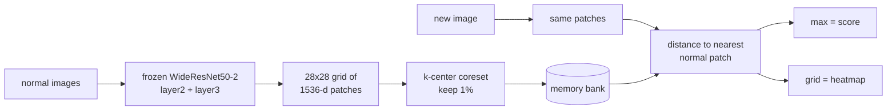

# Explainable Visual Defect Detector

Finds defects in product photos and shows where they are. It is trained on normal
images only, so it never sees a labelled defect during training.


Mean image AUROC **0.9874** over all 15 MVTec AD categories. The PatchCore paper
reports 0.990.

[](https://github.com/aghasalim/explainable-defect-detector/actions/workflows/ci.yml)

> **Status:** the demo is not public yet. It runs locally with
> `uv run streamlit run app.py`. See [Deploying](#deploying).

## The idea

A factory has plenty of good parts and very few bad ones. So instead of training a
classifier on defects, I model what a normal part looks like and flag anything that
sits far away from it.

MVTec AD is built for this. Its `train/` folder holds only good images and every
defect is in `test/`. Training a normal classifier means taking defects out of the
test set, which breaks the only clean evaluation split the dataset has.

## How it works



There is no training loop. The backbone is frozen and the only thing stored is a
bank of normal patches. Each category takes 6 to 108 seconds to fit and score on a
laptop GPU.

## Results

1% coreset, `Resize(256)+CenterCrop(224)`. Paper columns are Roth et al., CVPR 2022.

| category | image AUROC | paper | pixel AUROC | paper | AUPRO | peak-in-mask |
|---|---|---|---|---|---|---|
| bottle | 1.0000 | 1.000 | 0.9770 | 0.986 | 0.8828 | 0.9841 |
| cable | 0.9983 | 0.993 | 0.9750 | 0.984 | 0.8698 | 0.9239 |
| capsule | 0.9773 | 0.980 | 0.9836 | 0.988 | 0.8783 | 0.6881 |
| carpet | 0.9904 | 0.987 | 0.9845 | 0.990 | 0.8819 | 0.8090 |
| grid | 0.9699 | 0.981 | 0.9620 | 0.987 | 0.8380 | 0.6316 |
| hazelnut | 1.0000 | 1.000 | 0.9758 | 0.987 | 0.8132 | 0.8571 |
| leather | 1.0000 | 1.000 | 0.9874 | 0.993 | 0.9164 | 0.8913 |
| metal_nut | 0.9990 | 0.998 | 0.9815 | 0.984 | 0.8824 | 0.9462 |
| pill | 0.9569 | 0.966 | 0.9722 | 0.976 | 0.8939 | 0.6950 |
| screw | 0.9412 | 0.981 | 0.9686 | 0.994 | 0.8231 | 0.4958 |
| tile | 0.9917 | 0.987 | 0.9372 | 0.959 | 0.7214 | 0.9048 |
| toothbrush | 1.0000 | 1.000 | 0.9784 | 0.987 | 0.7543 | 0.5667 |
| transistor | 1.0000 | 1.000 | 0.9407 | 0.964 | 0.8613 | 0.9500 |
| wood | 0.9895 | 0.992 | 0.9230 | 0.951 | 0.7722 | 0.9000 |
| zipper | 0.9968 | 0.985 | 0.9784 | 0.989 | 0.8967 | 0.9664 |
| **mean** | **0.9874** | 0.990 | **0.9684** | 0.981 | **0.8457** | **0.8140** |

`peak-in-mask` is the share of defect images where the hottest pixel of the heatmap
falls inside the real defect. Full tables, including a random-heatmap control for
every localisation number, are in [reports/results.md](reports/results.md).

## What I found

**Detecting and locating are two different problems.** `toothbrush` scores a perfect
1.0000 image AUROC, but its heatmap points at the actual defect only 57% of the time.
`screw` detects at 0.941 and locates at 0.496. Reporting AUROC alone would hide this
completely, which is why I measured localisation separately.

**A supervised model detects just as well and explains much worse.** I trained a
ResNet18 classifier on half the test defects and compared it to PatchCore on the same
held-out half:

| category | classifier AUROC | PatchCore AUROC | Grad-CAM peak-in-mask | PatchCore peak-in-mask |
|---|---|---|---|---|
| bottle | 1.0000 | 1.0000 | 0.6875 | 0.9688 |
| pill | 0.9526 | 0.9579 | 0.3562 | 0.6712 |
| screw | 0.9586 | 0.9375 | 0.0000 | 0.4918 |

On `screw` the classifier reaches 0.96 AUROC while its Grad-CAM never lands on the
defect and scores 0.58 pixel AUROC, which is close to random. It gets the answer right
for reasons that have nothing to do with the defect.

**Coreset sampling does most of the work.** With the same bank size on `screw`, random
sampling scores 0.5518 and greedy k-center scores 0.8737. The image score is a max over
patch distances, so if the bank misses rare-but-normal patches, good images get flagged.

**Preprocessing beat every model knob.** Growing the memory bank from 1% to 10% took
`screw` from 0.8737 to 0.9289 and cost 8x the compute. Just using the paper's centre
crop got 0.9412 at 1%, because the crop zooms in and `screw` defects are tiny.

## Picking a threshold

A benchmark reports AUROC, but a demo has to say OK or DEFECT. I take the threshold
from held-out normal training images at their 99th percentile, aiming for a 1% false
alarm rate, so the test set is never involved. On the real test split:

| category | target FPR | actual FPR | recall |
|---|---|---|---|
| bottle | 1% | 0.0% | 100.0% |
| pill | 1% | 7.7% | 81.6% |
| screw | 1% | 0.0% | 53.8% |

20 to 40 calibration images is too few. `pill` misses its false alarm target by 7x and
`screw` ends up so strict it catches only half the defects. Fixing this is on the list
below.

## Bugs worth mentioning

- The official MVTec download is dead, so the data comes from a HuggingFace mirror.
  That mirror renames files, and an image and its own mask get different suffixes
  (`000-94.png` vs `000_mask-67.png`). Matching them by name gives zero masks and no
  warning. `fetch_mvtec.py` now fails the download if any defect image lacks a mask.
- The heatmap blur used zero padding, which pushed scores down near the image border.
  Switching to reflect padding moved `screw` pixel AUROC from 0.9544 to 0.9686.
- My first crop measurement compared pixel counts at two different zoom levels and
  reported "129% of the defect retained", which is impossible.

## Running it

```bash
uv sync
python src/edd/fetch_mvtec.py bottle       # download one category
uv run pytest tests/ -q                    # self-checks, no data needed
uv run python src/edd/patchcore.py bottle --crop
uv run python src/edd/explain.py bottle    # localisation vs random control
uv run python src/edd/classifier.py bottle # supervised + Grad-CAM comparison
uv run python src/edd/sweep.py             # all 15 categories, ~11 min
uv run python src/edd/report.py            # writes reports/results.md
```

Demo:

```bash
uv run python src/edd/export.py bottle screw pill
uv run streamlit run app.py
```

Images are not committed. `fetch_mvtec.py` rebuilds them from the tracked index.

## Deploying

Not public yet. The target is Streamlit Community Cloud: sign in at
share.streamlit.io, point it at this repo, branch `main`, main file `app.py`.
`requirements.txt` pins the CPU build of PyTorch, since the default Linux wheel is the
2 GB CUDA one.

Hugging Face Spaces also works through `scripts/deploy_space.sh`, but HF now needs a
PRO subscription for Docker Spaces, so the free tier rejects it with HTTP 402.

## What I would do next

1. Add the score reweighting from the paper. It is the one part I left out and the
   likely reason `screw` is 4 points short.
2. Calibrate the threshold on more images, or fit the tail instead of taking a raw
   percentile.
3. Improve localisation on `screw`, `toothbrush`, `grid` and `capsule`. Higher input
   resolution and adding `layer1` features are the obvious things to try.
4. Test it on parts I photograph myself, where the lighting is not controlled.
5. Swap the brute-force nearest neighbour for an approximate index if the bank grows.

## Notes on method

- Image score is a plain max over patch distances. The paper adds a reweighting step.
- The coreset search runs in a 128-d random projection for speed. The bank keeps the
  full 1536-d vectors.
- MVTec has no validation split, so the headline settings are fixed to the paper's and
  everything else is reported as an ablation rather than picked as a best result.
- Pixel AUROC cannot be compared between the crop and resize rows, since the crop
  changes which pixels are being scored.

## Data and licence

Code is MIT. Data is [MVTec AD](https://www.mvtec.com/company/research/datasets/mvtec-ad),
CC BY-NC-SA 4.0, research and non-commercial use.
