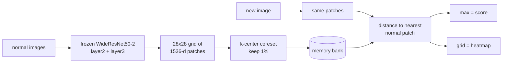
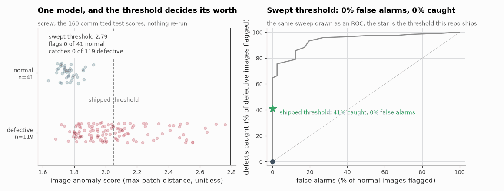

# Explainable Visual Defect Detector

Finds defects in product photos and shows where they are. It is trained on normal
images only, so it never sees a labelled defect during training.


Mean image AUROC **0.9874** over all 15 MVTec AD categories. The PatchCore paper
reports 0.990.

[](https://github.com/aghasalim/explainable-defect-detector/actions/workflows/ci.yml)
[](https://github.com/aghasalim/explainable-defect-detector/actions/workflows/demo.yml)

**[Try it live](https://explainable-defect-detector.streamlit.app/)**: pick one of the 15
object types, try a sample or upload your own photo. Each category ships a defect the model
catches and, where one exists, a defect it *misses*, labelled as such.


---

## Abstract

Visual anomaly detection is usually reported as an image-level AUROC, which says
nothing about whether the heatmap points at the defect or whether the deployment
threshold delivers the false-positive rate it claims. This work reimplements
PatchCore across all 15 MVTec-AD categories and reports three things the headline
metric leaves out.

Reproduction is checked against the published numbers per category rather than in
aggregate. Localisation is scored against a control that has no spatial
information, because a heatmap can look convincing and still be no better than
chance at pointing anywhere useful, the measured peak-in-mask rate clears its
control by a wide margin in every category, worst case `screw` at 0.50 against
0.00. And the threshold is calibrated with a distribution-free tolerance bound
rather than a percentile, which needs 299 normal calibration images for a
95%-confidence 1% bound. MVTec's training splits are smaller than that for most
categories, so the guarantee is reported as unmet rather than quietly assumed.

**Contributions.** (i) Per-category reproduction against published values. (ii) A
spatial control for localisation claims. (iii) A distribution-free threshold with
its sample-size requirement stated and checked. (iv) A realised-FPR verification
on held-out test data, separate from the calibration split.

---

## 1. The idea

A factory has plenty of good parts and very few bad ones. So instead of training a
classifier on defects, I model what a normal part looks like and flag anything that
sits far away from it.

MVTec AD is built for this. Its `train/` folder holds only good images and every
defect is in `test/`. Training a normal classifier means taking defects out of the
test set, which breaks the only clean evaluation split the dataset has.

## 2. Method



There is no training loop. The backbone is frozen and the only thing stored is a
bank of normal patches. Each category takes 6 to 108 seconds to fit and score on a
laptop GPU.

## 3. Results
The control is the point of the second figure.


Full detail in [notes/METHODS.md](notes/METHODS.md#3-results).
## 4. What I found
**Detecting and locating are two different problems.** `toothbrush` scores a perfect 1.0000 image AUROC, but its heatmap points at the actual defect only 57% of the time.

Full detail in [notes/METHODS.md](notes/METHODS.md#4-what-i-found).
## 5. Picking a threshold
The last figure is the one I would want to be asked about.




*The decision threshold sliding across the 160 committed `screw` test scores. The model never changes, so every false alarm and every catch that appears is bought purely by moving the cut.*


Full detail in [notes/METHODS.md](notes/METHODS.md#5-picking-a-threshold).
## 6. Bugs worth mentioning
- The official MVTec download is dead, so the data comes from a HuggingFace mirror.

Full detail in [notes/METHODS.md](notes/METHODS.md#6-bugs-worth-mentioning).
## 7. Everything here is computed twice

Every number in this README came out of one Python process. The metrics in
`reports/*.json` were computed by the script that wrote them, the tables in
`reports/*.md` were formatted by the script that wrote those, and the sentences
here were typed out of both. Nothing ever read any of it back, so nothing could
tell me when a number went stale. Two had: the README claimed 79 MB of exported
models when the committed files are 87 MB, and it credited `screw` with a
localisation control of 0.01 when its run file says 0.00.

`verify/` recomputes what is published from the rawest file that still exists,
in a language that is not the one that produced it. A mistake now has to be made
identically twice to survive. `verify/verify.sh` runs all of them and exits
non-zero if any two disagree; CI runs it, then corrupts a results file and
requires the harness to reject it.

| language | recomputes | from | measured agreement |
|---|---|---|---|
| SQL | the headline mean, the notes table, the `screw` ablations | 15 `bench_*.json` and 4 run files | 26 of 26 published lines rebuilt exactly |
| SQL | every table and sentence of the EDA report | `eda_bottle.json`, 292 per image rows | 23 of 23 lines rebuilt exactly |
| C | AUROC, average precision, best F1 and its threshold, accuracy | the per image score lists in 12 run files | 120 published fields, worst gap 1.6e-15 |
| Go | image counts, model card arithmetic, file structure | `data/_mvtec_index.json`, 56 committed JSON files | 15426 checks, all agree |
| R | the 299 image requirement, intervals on peak-in-mask, exact tests on the realised false-alarm rate | `models/*.json`, `bench_*.json`, `threshold_check.json` | 299 found by search, 15 of 15 controls cleared, sign test p = 3.05e-05 |
| Rust | AUROC by comparing every positive with every negative, and the coverage of the calibration rule by simulation | the same 12 score lists, 1e7 trials per size | worst gap 1.1e-16, simulated coverage 1.31 standard errors from the closed form |
| JavaScript | every row of `reports/benchmark.md` and `reports/results.md` | `bench_*.json`, `compare_*.json`, `threshold_check.json` | 93 table lines and 3 sentences, character for character |
| Java | the calibration tables, and the shipped threshold across the three files that record it | `calibration_compare.json`, `models/*.json`, `threshold_check.json` | 15 of 15 thresholds identical, summary rows inside their last digit |
| Ruby | the held-out half, and the PatchCore numbers reported on it | `split_*.json`, `patchcore-224crop_*.json` | AUROC exact on 3 categories, average precision worst gap 3.3e-16 |

A check that cannot fail proves nothing, so each was tested by corrupting the
file it reads. Twelve corruptions, twelve rejections: a changed peak-in-mask is
caught by SQL, R and JavaScript, a changed image score by C and Rust, a wrong
test count by Go, a wrong sample size requirement by R and Rust, a flipped demo
verdict by Go, a shifted calibration recall by Java, and a contaminated split by
Ruby.

What is not covered: the pixel level metrics, since the anomaly maps and the
masks they are scored against are not committed. Those are checked for
structure and for agreement with the tables that publish them, not recomputed.

```bash
./verify/verify.sh                         # 9 passed, 0 failed, 0 skipped
```

## 8. Running it

```bash
uv sync
python src/edd/fetch_mvtec.py bottle       # download one category
uv run pytest tests/ -q                    # self-checks, no data needed
uv run python src/edd/patchcore.py bottle --crop
uv run python src/edd/explain.py bottle    # localisation vs random control
uv run python src/edd/classifier.py bottle # supervised + Grad-CAM comparison
uv run python src/edd/sweep.py             # all 15 categories, ~11 min
uv run python src/edd/report.py            # writes reports/results.md
```

Demo:

```bash
uv run python src/edd/export.py --all      # all 15, or name them: export.py bottle screw
uv run python src/edd/samples.py           # picks demo images by actually scoring them
uv run python src/edd/verify_threshold.py  # the table above
uv run streamlit run app.py
```

All 15 categories are exported and committed under `models/` (87 MB total). The memory
banks are stored as float16, which halves them; I checked and it changes scores by at
most 1.8e-4 and flips no verdict on 410 test images.

Images are not committed. `fetch_mvtec.py` rebuilds them from the tracked index.

## 9. Deploying

Live on Streamlit Community Cloud at
[explainable-defect-detector.streamlit.app](https://explainable-defect-detector.streamlit.app/),
deployed from this repo, branch `main`, main file `app.py`, Python 3.12. It redeploys on
every push. `requirements.txt` pins the CPU build of PyTorch, since the default Linux
wheel is the 2 GB CUDA one and the free tier will not hold it.

Hugging Face Spaces also works through `scripts/deploy_space.sh`, but HF now needs a
PRO subscription for Docker Spaces, so the free tier rejects it with HTTP 402.

## 10. What I would do next

1. Add the score reweighting from the paper. It is the one part I left out and the
   likely reason `screw` is 4 points short.
2. Calibrate the threshold on more images, or fit the tail instead of taking a raw
   percentile.
3. Improve localisation on `screw`, `toothbrush`, `grid` and `capsule`. Higher input
   resolution and adding `layer1` features are the obvious things to try.
4. Test it on parts I photograph myself, where the lighting is not controlled.
5. Swap the brute-force nearest neighbour for an approximate index if the bank grows.

## 11. Notes on method

- Image score is a plain max over patch distances. The paper adds a reweighting step.
- The coreset search runs in a 128-d random projection for speed. The bank keeps the
  full 1536-d vectors.
- MVTec has no validation split, so the headline settings are fixed to the paper's and
  everything else is reported as an ablation rather than picked as a best result.
- Pixel AUROC cannot be compared between the crop and resize rows, since the crop
  changes which pixels are being scored.

## 12. Data and licence

Code is MIT. Data is [MVTec AD](https://www.mvtec.com/company/research/datasets/mvtec-ad),
CC BY-NC-SA 4.0, research and non-commercial use.

## References

The papers and sources this implementation follows. Each one is here because
the code uses the method, the dataset or the metric it describes.

- **Roth, Pemula, Zepeda, Schölkopf, Brox, Gehler. Towards Total Recall in Industrial Anomaly Detection. CVPR 2022.** [arXiv:2106.08265](https://arxiv.org/abs/2106.08265) PatchCore, the main detector.
- **Defard, Setkov, Loesch, Audigier. PaDiM: a Patch Distribution Modeling Framework. ICPR 2021.** [arXiv:2011.08785](https://arxiv.org/abs/2011.08785) the PaDiM baseline.
- **Bergmann, Fauser, Sattlegger, Steger. MVTec AD: A Comprehensive Real-World Dataset for Unsupervised Anomaly Detection. CVPR 2019.** the dataset.
- **He, Zhang, Ren, Sun. Deep Residual Learning for Image Recognition. CVPR 2016.** [arXiv:1512.03385](https://arxiv.org/abs/1512.03385) the ResNet backbone.
- **Zagoruyko, Komodakis. Wide Residual Networks. BMVC 2016.** [arXiv:1605.07146](https://arxiv.org/abs/1605.07146) the WideResNet backbone.
