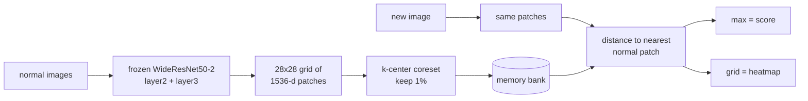

# Explainable Visual Defect Detector

Finds defects in product photos and shows where they are. It is trained on normal
images only, so it never sees a labelled defect during training.


Mean image AUROC **0.9874** over all 15 MVTec AD categories. The PatchCore paper
reports 0.990.

[](https://github.com/aghasalim/explainable-defect-detector/actions/workflows/ci.yml)
[](https://github.com/aghasalim/explainable-defect-detector/actions/workflows/demo.yml)
[](https://doi.org/10.5281/zenodo.23003629)

**[Try it live](https://explainable-defect-detector.streamlit.app/)**: pick one of the 15
object types, try a sample or upload your own photo. Each category ships a defect the model
catches and, where one exists, a defect it *misses*, labelled as such.


---

## Abstract

Visual anomaly detection is usually reported as an image-level AUROC, which says
nothing about whether the heatmap points at the defect or whether the deployment
threshold delivers the false-positive rate it claims. This work reimplements
PatchCore across all 15 MVTec-AD categories and reports three things the headline
metric leaves out.

Reproduction is checked against the published numbers per category, not in
aggregate. Localisation is scored against a control that has no spatial
information, because a heatmap can look convincing and still be no better than
chance at pointing anywhere useful, the measured peak-in-mask rate clears its
control by a wide margin in every category, worst case `screw` at 0.50 against
0.00. And the threshold is calibrated with a distribution-free tolerance bound
instead of a percentile, which needs 299 normal calibration images for a
95%-confidence 1% bound. MVTec's training splits are smaller than that for most
categories, so the guarantee is reported as unmet.
Every number reported here is recomputed from the raw result files by
independent implementations in `verify/`, and CI fails if any of them disagree.

Contributions. (i) Per-category reproduction against published values. (ii) A
spatial control for localisation claims. (iii) A distribution-free threshold with
its sample-size requirement stated and checked. (iv) A realised-FPR verification
on held-out test data, separate from the calibration split.

---

## 1. The idea

A factory has plenty of good parts and very few bad ones. So I model what a normal part looks like and flag anything that
sits far away from it.

MVTec AD is built for this. Its `train/` folder holds only good images and every
defect is in `test/`. Training a normal classifier means taking defects out of the
test set, which breaks the only clean evaluation split the dataset has.

## 2. Method


```mermaid
flowchart LR
    A[normal images] --> B[frozen WideResNet50-2<br/>layer2 + layer3]
    B --> C[28x28 grid of<br/>1536-d patches]
    C --> D[k-center coreset<br/>keep 1%]
    D --> E[(memory bank)]
    F[new image] --> G[same patches]
    G --> H[distance to nearest<br/>normal patch]
    E --> H
    H --> I[max = score]
    H --> J[grid = heatmap]
```

There is no training loop. The backbone is frozen and the only thing stored is a
bank of normal patches. Each category takes 6 to 108 seconds to fit and score on a
laptop GPU.

## 3. Results
The control is the point of the second figure.


Full detail in [notes/METHODS.md](notes/METHODS.md#3-results). That table is one seed,
run on an Apple M4 laptop GPU (MPS).

Over five seeds. The same configuration, run with seeds 0 to 4 on one NVIDIA RTX A5000
with CUDA. The seed changes the coreset and the calibration folds. The backbone and the
test images stay fixed. Mean and sample standard deviation over seeds:

| category | image AUROC | pixel AUROC | AUPRO |
|---|---|---|---|
| bottle | 1.0000 ± 0.0000 | 0.9831 ± 0.0001 | 0.9291 ± 0.0018 |
| cable | 0.9968 ± 0.0021 | 0.9841 ± 0.0003 | 0.9244 ± 0.0019 |
| capsule | 0.9777 ± 0.0072 | 0.9867 ± 0.0003 | 0.9075 ± 0.0059 |
| carpet | 0.9887 ± 0.0015 | 0.9878 ± 0.0001 | 0.9313 ± 0.0019 |
| grid | 0.9781 ± 0.0078 | 0.9700 ± 0.0021 | 0.8780 ± 0.0077 |
| hazelnut | 1.0000 ± 0.0000 | 0.9844 ± 0.0003 | 0.9365 ± 0.0037 |
| leather | 1.0000 ± 0.0000 | 0.9906 ± 0.0001 | 0.9584 ± 0.0007 |
| metal_nut | 0.9988 ± 0.0010 | 0.9844 ± 0.0006 | 0.9157 ± 0.0023 |
| pill | 0.9541 ± 0.0032 | 0.9766 ± 0.0017 | 0.9284 ± 0.0015 |
| screw | 0.9438 ± 0.0175 | 0.9786 ± 0.0028 | 0.9060 ± 0.0098 |
| tile | 0.9879 ± 0.0017 | 0.9552 ± 0.0007 | 0.7953 ± 0.0032 |
| toothbrush | 0.9967 ± 0.0050 | 0.9856 ± 0.0008 | 0.8423 ± 0.0149 |
| transistor | 0.9997 ± 0.0007 | 0.9732 ± 0.0030 | 0.9463 ± 0.0016 |
| wood | 0.9912 ± 0.0018 | 0.9398 ± 0.0014 | 0.8344 ± 0.0012 |
| zipper | 0.9960 ± 0.0008 | 0.9826 ± 0.0001 | 0.9282 ± 0.0009 |
| mean | 0.9873 ± 0.0016 | 0.9775 ± 0.0003 | 0.9041 ± 0.0005 |

`screw` moves the most, 0.9438 ± 0.0175 image AUROC. Raw runs are in `reports/seeds/`
and the table is in [reports/seeds.md](reports/seeds.md).

Against anomalib. The same 15 categories and seeds 0 to 4, run through anomalib 2.7.0's
`PatchcoreModel` on the same RTX A5000. Only the model is anomalib's. The images,
preprocessing, masks and every metric come from this repo's code. anomalib brings its own
timm WideResNet50-2, its own coreset, the paper's score reweighting and a Gaussian blur on
the map. Mean over categories, then mean and standard deviation over seeds:

| model | image AUROC | pixel AUROC | AUPRO |
|---|---|---|---|
| this repo | 0.9873 ± 0.0016 | 0.9775 ± 0.0003 | 0.9041 ± 0.0005 |
| anomalib | 0.9882 ± 0.0013 | 0.9750 ± 0.0003 | 0.9035 ± 0.0009 |

The means are within 0.003 of each other. The biggest gap is `screw` image AUROC, 0.9438
here against 0.9720 for anomalib. That fits the missing reweighting, but anomalib differs
in more than that, so it does not prove it. Per category, anomalib leads on `grid` AUPRO by
0.0209 and this repo leads on `cable` AUPRO by 0.0260. Full table in
[reports/anomalib.md](reports/anomalib.md).
## 4. What I found
Detecting and locating are two different problems. `toothbrush` scores a perfect 1.0000 image AUROC, but its heatmap points at the actual defect only 57% of the time.

Full detail in [notes/METHODS.md](notes/METHODS.md#4-what-i-found).
## 5. Picking a threshold
The last figure is the one I would want to be asked about.


*The decision threshold sliding across the 160 committed `screw` test scores. The model never changes, so every false alarm and every catch that appears is bought purely by moving the cut.*


On the five CUDA runs, seed 0 flags 7 of 467 normal test images over all 15 categories,
1.5%, with a Wilson 95% interval of 0.7% to 3.1%. `carpet` flags 5 of 28, 17.9%
(7.9% to 35.6%), and 17.9% to 21.4% across the five seeds. No other category goes
above 4.8% on any seed (`grid`, 1 of 21). The intervals are wide because a category has only 12
to 60 normal test images. The per-category table is in [reports/seeds.md](reports/seeds.md),
and `verify/verify.R` rebuilds every row of it with R's own `prop.test`.

Full detail in [notes/METHODS.md](notes/METHODS.md#5-picking-a-threshold).
## 6. Bugs worth mentioning
- The official MVTec download is dead, so the data comes from a HuggingFace mirror.
- Pixel AUROC and AUPRO used to skip the normal test images. With the standard
  protocol, mean AUPRO is 0.9025, up from 0.8457.

Full detail in [notes/METHODS.md](notes/METHODS.md#6-bugs-worth-mentioning).
## 7. Running it

```bash
uv sync
python src/edd/fetch_mvtec.py bottle       # download one category
uv run pytest tests/ -q                    # self-checks, no data needed
uv run python src/edd/patchcore.py bottle --crop
uv run python src/edd/explain.py bottle    # localisation vs random control
uv run python src/edd/classifier.py bottle # supervised + Grad-CAM comparison
uv run python src/edd/sweep.py             # all 15 categories, ~11 min
uv run python src/edd/seeds.py             # 15 categories x 5 seeds
uv run python src/edd/vs_anomalib.py --table-only  # needs anomalib runs, see the file
uv run python src/edd/report.py            # writes reports/results.md
```

Demo:

```bash
uv run python src/edd/export.py --all      # all 15, or name them: export.py bottle screw
uv run python src/edd/samples.py           # picks demo images by actually scoring them
uv run python src/edd/verify_threshold.py  # the table above
uv run streamlit run app.py
```

All 15 categories are exported and committed under `models/` (87 MB total). The memory
banks are stored as float16, which halves them; I checked and it changes scores by at
most 1.8e-4 and flips no verdict on 410 test images.

Images are not committed. `fetch_mvtec.py` rebuilds them from the tracked index.

## 8. Deploying

Live on Streamlit Community Cloud at
[explainable-defect-detector.streamlit.app](https://explainable-defect-detector.streamlit.app/),
deployed from this repo, branch `main`, main file `app.py`, Python 3.12. It redeploys on
every push. `requirements.txt` pins the CPU build of PyTorch, since the default Linux
wheel is the 2 GB CUDA one and the free tier will not hold it.

Hugging Face Spaces also works through `scripts/deploy_space.sh`, but HF now needs a
PRO subscription for Docker Spaces, so the free tier rejects it with HTTP 402.

## 9. What I would do next

1. Add the score reweighting from the paper. It is the one part I left out and the
   likely reason `screw` is 4 points short. anomalib, which has it, scores `screw` at
   0.9720 over five seeds, against 0.9438 here.
2. Calibrate the threshold on more images, or fit a model to the tail.
3. Improve localisation on `screw`, `toothbrush`, `grid` and `capsule`. Higher input
   resolution and adding `layer1` features are the obvious things to try.
4. Test it on parts I photograph myself, where the lighting is not controlled.
5. Swap the brute-force nearest neighbour for an approximate index if the bank grows.

## 10. Notes on method

- Image score is a plain max over patch distances. The paper adds a reweighting step.
- The coreset search runs in a 128-d random projection for speed. The bank keeps the
  full 1536-d vectors.
- MVTec has no validation split, so the headline settings are fixed to the paper's and
  everything else is reported as an ablation, and none of it was used to pick a best result.
- Pixel AUROC cannot be compared between the crop and resize rows, since the crop
  changes which pixels are being scored.

## 11. Data and licence

Code is MIT. Data is [MVTec AD](https://www.mvtec.com/company/research/datasets/mvtec-ad),
CC BY-NC-SA 4.0, research and non-commercial use.

## References

PatchCore and PaDiM are the detectors reimplemented here, MVTec AD is the data
they run on, and the last two describe the frozen backbone the patches come out
of. Nothing below is background reading.

- **Roth, Pemula, Zepeda, Schölkopf, Brox, Gehler. Towards Total Recall in Industrial Anomaly Detection. CVPR 2022.** [arXiv:2106.08265](https://arxiv.org/abs/2106.08265) PatchCore, the main detector.
- **Defard, Setkov, Loesch, Audigier. PaDiM: a Patch Distribution Modeling Framework. ICPR 2021.** [arXiv:2011.08785](https://arxiv.org/abs/2011.08785) the PaDiM baseline.
- **Bergmann, Fauser, Sattlegger, Steger. MVTec AD: A Comprehensive Real-World Dataset for Unsupervised Anomaly Detection. CVPR 2019.** the dataset.
- **He, Zhang, Ren, Sun. Deep Residual Learning for Image Recognition. CVPR 2016.** [arXiv:1512.03385](https://arxiv.org/abs/1512.03385) the ResNet backbone.
- **Zagoruyko, Komodakis. Wide Residual Networks. BMVC 2016.** [arXiv:1605.07146](https://arxiv.org/abs/1605.07146) the WideResNet backbone.
