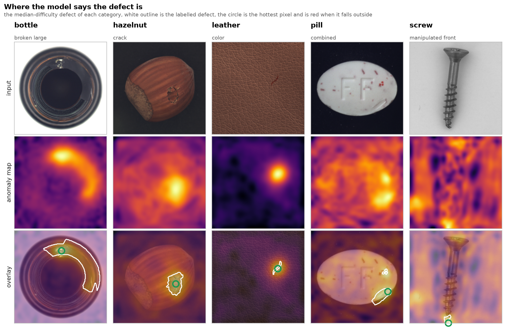
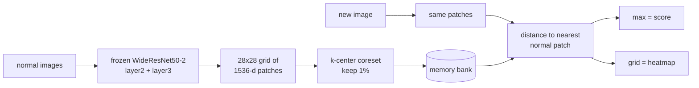
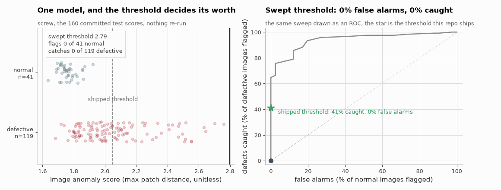

# Explainable Visual Defect Detector

This finds defects in product photos and shows where they are. I train it only on
normal images, so it never sees a labelled defect during training.



Mean image AUROC **0.9874** over all 15 MVTec AD categories. The PatchCore paper
reports 0.990.

[](https://github.com/aghasalim/explainable-defect-detector/actions/workflows/ci.yml)
[](https://github.com/aghasalim/explainable-defect-detector/actions/workflows/demo.yml)
[](https://doi.org/10.5281/zenodo.23003629)

**[Try it live](https://explainable-defect-detector.streamlit.app/)**. Pick one of the 15
object types, then try a sample or upload your own photo. Each category comes with a defect
the model catches. Where I found one, there's also a defect it *misses*, and it's labelled
that way.


---

## Abstract

People usually report visual anomaly detection as one image-level AUROC. That
number doesn't tell you if the heatmap points at the defect. It also doesn't tell
you if the threshold you deploy gives the false-positive rate you think it does.
I reimplemented PatchCore on all 15 MVTec-AD categories and looked at those
missing pieces.

First, I checked my reproduction against the published numbers for each category
separately, and didn't just compare the averages. Second, I scored localisation
against a control that has no spatial information. A heatmap can look convincing
and still be no better than chance at pointing somewhere useful. My
peak-in-mask rate beats its control by a lot in every category, with the
worst case `screw` at 0.50 against 0.00. Third, I calibrated the threshold with
a distribution-free tolerance bound instead of a percentile. That needs 299
normal calibration images for a 95%-confidence 1% bound. For most categories
MVTec's training split is smaller than that, so I report the guarantee as not
met.
Separate implementations in `verify/` recompute every number here from the raw
result files, and CI fails if any of them disagree.

What's in the repo:

- A reproduction checked category by category against the published values.
- A spatial control for localisation claims.
- A distribution-free threshold, with the sample size it needs stated and
  checked.
- A check of the real false-positive rate on held-out test data, kept separate
  from the calibration split.

---

## 1. The idea

A factory has lots of good parts and very few bad ones. So I model what a normal
part looks like and flag anything that's far away from it.

MVTec AD is made for this. Its `train/` folder only has good images, and every
defect is in `test/`. To train a normal classifier you'd have to take defects out
of the test set, and that ruins the only clean evaluation split the dataset has.

## 2. Method


```mermaid
flowchart LR
    A[normal images] --> B[frozen WideResNet50-2<br/>layer2 + layer3]
    B --> C[28x28 grid of<br/>1536-d patches]
    C --> D[k-center coreset<br/>keep 1%]
    D --> E[(memory bank)]
    F[new image] --> G[same patches]
    G --> H[distance to nearest<br/>normal patch]
    E --> H
    H --> I[max = score]
    H --> J[grid = heatmap]
```

There's no training loop. The backbone is frozen, and all I store is a bank of
normal patches. Each category takes 6 to 108 seconds to fit and score on a laptop
GPU.

## 3. Results
In the second figure, look at the control.


More detail is in [notes/METHODS.md](notes/METHODS.md#3-results). That table is from one
seed, run on an Apple M4 laptop GPU (MPS).

I also ran the same configuration with seeds 0 to 4 on one NVIDIA RTX A5000 with CUDA. The
seed changes the coreset and the calibration folds, while the backbone and the test images
stay the same. Below are the mean and sample standard deviation over seeds.

| category | image AUROC | pixel AUROC | AUPRO |
|---|---|---|---|
| bottle | 1.0000 ± 0.0000 | 0.9831 ± 0.0001 | 0.9291 ± 0.0018 |
| cable | 0.9968 ± 0.0021 | 0.9841 ± 0.0003 | 0.9244 ± 0.0019 |
| capsule | 0.9777 ± 0.0072 | 0.9867 ± 0.0003 | 0.9075 ± 0.0059 |
| carpet | 0.9887 ± 0.0015 | 0.9878 ± 0.0001 | 0.9313 ± 0.0019 |
| grid | 0.9781 ± 0.0078 | 0.9700 ± 0.0021 | 0.8780 ± 0.0077 |
| hazelnut | 1.0000 ± 0.0000 | 0.9844 ± 0.0003 | 0.9365 ± 0.0037 |
| leather | 1.0000 ± 0.0000 | 0.9906 ± 0.0001 | 0.9584 ± 0.0007 |
| metal_nut | 0.9988 ± 0.0010 | 0.9844 ± 0.0006 | 0.9157 ± 0.0023 |
| pill | 0.9541 ± 0.0032 | 0.9766 ± 0.0017 | 0.9284 ± 0.0015 |
| screw | 0.9438 ± 0.0175 | 0.9786 ± 0.0028 | 0.9060 ± 0.0098 |
| tile | 0.9879 ± 0.0017 | 0.9552 ± 0.0007 | 0.7953 ± 0.0032 |
| toothbrush | 0.9967 ± 0.0050 | 0.9856 ± 0.0008 | 0.8423 ± 0.0149 |
| transistor | 0.9997 ± 0.0007 | 0.9732 ± 0.0030 | 0.9463 ± 0.0016 |
| wood | 0.9912 ± 0.0018 | 0.9398 ± 0.0014 | 0.8344 ± 0.0012 |
| zipper | 0.9960 ± 0.0008 | 0.9826 ± 0.0001 | 0.9282 ± 0.0009 |
| mean | 0.9873 ± 0.0016 | 0.9775 ± 0.0003 | 0.9041 ± 0.0005 |

`screw` moves the most, at 0.9438 ± 0.0175 image AUROC. The raw runs are in
`reports/seeds/` and the table is in [reports/seeds.md](reports/seeds.md).

I also compared against anomalib. I ran the same 15 categories and seeds 0 to 4 through
anomalib 2.7.0's `PatchcoreModel` on the same RTX A5000. Only the model comes from anomalib.
The images, preprocessing, masks and all the metrics come from my code. anomalib uses its
own timm WideResNet50-2 and its own coreset, and it adds the paper's score reweighting and a
Gaussian blur on the map. The table shows the mean over categories, then the mean and
standard deviation over seeds.

| model | image AUROC | pixel AUROC | AUPRO |
|---|---|---|---|
| this repo | 0.9873 ± 0.0016 | 0.9775 ± 0.0003 | 0.9041 ± 0.0005 |
| anomalib | 0.9882 ± 0.0013 | 0.9750 ± 0.0003 | 0.9035 ± 0.0009 |

The means are within 0.003 of each other. The biggest gap is `screw` image AUROC, with
0.9438 for mine against 0.9720 for anomalib. That would fit with me leaving out the
reweighting, but anomalib differs in other ways too, so I can't be sure. By category,
anomalib is ahead on `grid` AUPRO by 0.0209, and mine is ahead on `cable` AUPRO by 0.0260.
The full table is in [reports/anomalib.md](reports/anomalib.md).
## 4. What I found
Finding that a defect exists and finding where it is turned out to be two different problems. `toothbrush` scores a perfect 1.0000 image AUROC, but its heatmap points at the actual defect only 57% of the time.

More detail is in [notes/METHODS.md](notes/METHODS.md#4-what-i-found).
## 5. Picking a threshold
If someone asked me about one figure, I'd want it to be the last one.




*The decision threshold moving across the 160 committed `screw` test scores. The model stays the same, so every false alarm and every catch you see comes only from moving the cut.*


In the five CUDA runs, seed 0 flags 7 of 467 normal test images across all 15
categories. That's 1.5%, with a Wilson 95% interval of 0.7% to 3.1%. `carpet` is the
outlier. It flags 5 of 28, which is 17.9% (7.9% to 35.6%), and it stays between 17.9% and
21.4% across the five seeds. No other category goes above 4.8% on any seed (`grid`, 1 of
21). The intervals are wide because each category only has 12 to 60 normal test images.
The table for each category is in [reports/seeds.md](reports/seeds.md), and
`verify/verify.R` rebuilds every row of it with R's own `prop.test`.

More detail is in [notes/METHODS.md](notes/METHODS.md#5-picking-a-threshold).
## 6. Bugs worth mentioning
- The official MVTec download link is dead, so I get the data from a HuggingFace mirror.
- Pixel AUROC and AUPRO used to leave out the normal test images. With the standard
  protocol, mean AUPRO is 0.9025, up from 0.8457.

More detail is in [notes/METHODS.md](notes/METHODS.md#6-bugs-worth-mentioning).
## 7. Running it

```bash
uv sync
python src/edd/fetch_mvtec.py bottle       # download one category
uv run pytest tests/ -q                    # self-checks, no data needed
uv run python src/edd/patchcore.py bottle --crop
uv run python src/edd/explain.py bottle    # localisation vs random control
uv run python src/edd/classifier.py bottle # supervised + Grad-CAM comparison
uv run python src/edd/sweep.py             # all 15 categories, ~11 min
uv run python src/edd/seeds.py             # 15 categories x 5 seeds
uv run python src/edd/vs_anomalib.py --table-only  # needs anomalib runs, see the file
uv run python src/edd/report.py            # writes reports/results.md
```

Demo:

```bash
uv run python src/edd/export.py --all      # all 15, or name them: export.py bottle screw
uv run python src/edd/samples.py           # picks demo images by actually scoring them
uv run python src/edd/verify_threshold.py  # the table above
uv run streamlit run app.py
```

All 15 categories are exported and committed under `models/` (87 MB total). I store the
memory banks as float16, which makes them half the size. I checked, and it changes scores
by at most 1.8e-4 and doesn't flip a single verdict on 410 test images.

The images aren't in the repo. `fetch_mvtec.py` downloads them again from the tracked
index.

## 8. Deploying

It runs on Streamlit Community Cloud at
[explainable-defect-detector.streamlit.app](https://explainable-defect-detector.streamlit.app/).
It deploys from this repo, branch `main`, main file `app.py`, with Python 3.12, and it
redeploys on every push. `requirements.txt` pins the CPU build of PyTorch, because the
default Linux wheel is the 2 GB CUDA one and the free tier can't fit it.

Hugging Face Spaces also works through `scripts/deploy_space.sh`. But HF now wants a PRO
subscription for Docker Spaces, so on the free tier it fails with HTTP 402.

## 9. What I would do next

1. Add the score reweighting from the paper. It's the one part I left out, and
   probably why `screw` is 4 points short. anomalib, which has it, scores `screw` at
   0.9720 over five seeds, against 0.9438 for mine.
2. Calibrate the threshold on more images, or fit a model to the tail.
3. Get better localisation on `screw`, `toothbrush`, `grid` and `capsule`. I'd start
   by trying a higher input resolution and adding `layer1` features.
4. Test it on parts I photograph myself, where the lighting isn't controlled.
5. Replace the brute-force nearest neighbour search with an approximate index if the
   bank gets bigger.

## 10. Notes on method

- The image score is just the max over patch distances. The paper adds a reweighting
  step on top.
- The coreset search runs in a 128-d random projection to save time. The bank still
  keeps the full 1536-d vectors.
- MVTec has no validation split. So I fixed the main settings to the paper's and report
  everything else as an ablation. I didn't use any of it to pick a best result.
- You can't compare pixel AUROC between the crop and resize rows, because cropping
  changes which pixels get scored.

## 11. Data and licence

The code is MIT. The data is [MVTec AD](https://www.mvtec.com/company/research/datasets/mvtec-ad),
CC BY-NC-SA 4.0, for research and non-commercial use.

## References

PatchCore and PaDiM are the detectors I reimplemented, MVTec AD is the data they
run on, and the last two papers describe the frozen backbone the patches come
from. I only list papers I actually used.

- **Roth, Pemula, Zepeda, Schölkopf, Brox, Gehler. Towards Total Recall in Industrial Anomaly Detection. CVPR 2022.** [arXiv:2106.08265](https://arxiv.org/abs/2106.08265) PatchCore, the main detector.
- **Defard, Setkov, Loesch, Audigier. PaDiM: a Patch Distribution Modeling Framework. ICPR 2021.** [arXiv:2011.08785](https://arxiv.org/abs/2011.08785) the PaDiM baseline.
- **Bergmann, Fauser, Sattlegger, Steger. MVTec AD: A Comprehensive Real-World Dataset for Unsupervised Anomaly Detection. CVPR 2019.** the dataset.
- **He, Zhang, Ren, Sun. Deep Residual Learning for Image Recognition. CVPR 2016.** [arXiv:1512.03385](https://arxiv.org/abs/1512.03385) the ResNet backbone.
- **Zagoruyko, Komodakis. Wide Residual Networks. BMVC 2016.** [arXiv:1605.07146](https://arxiv.org/abs/1605.07146) the WideResNet backbone.
