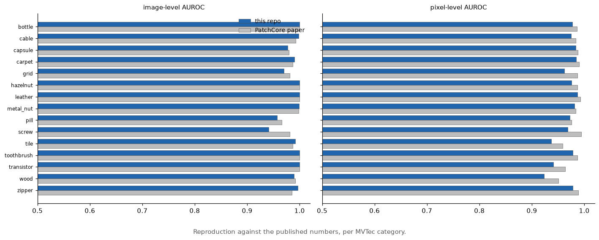
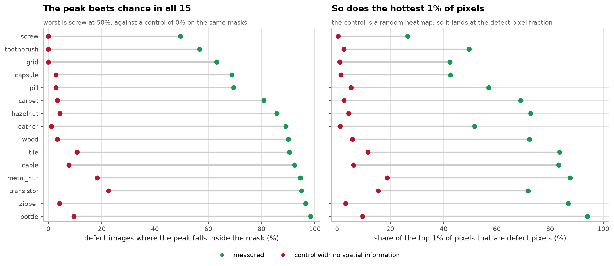
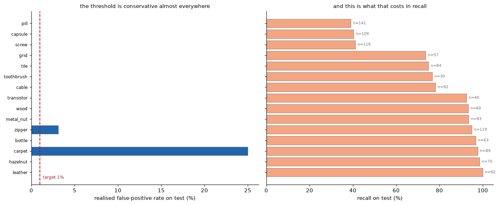
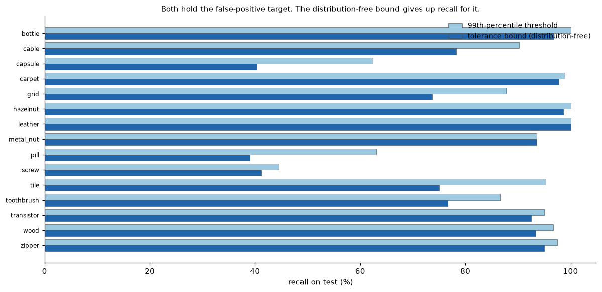
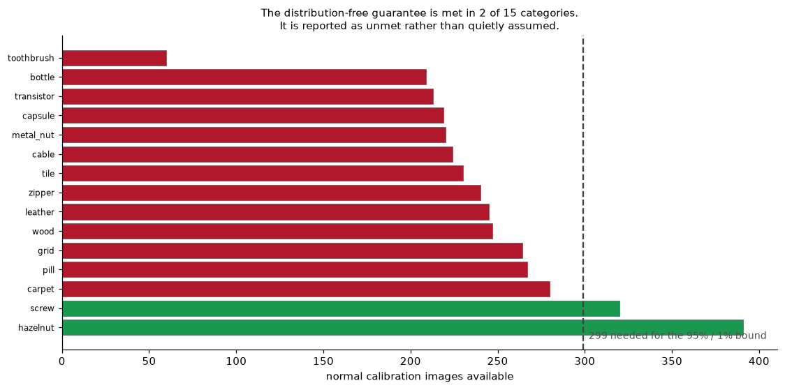

# Methods and detail

Long form detail moved out of the README.

## 3. Results

The control is the point of the second figure. A heatmap that looks plausible is
not evidence of localisation; what counts is beating a score that has no spatial
information on the same masks. It does, in every category, worst case `screw` at
0.50 peak-in-mask against a control of 0.00.

1% coreset, `Resize(256)+CenterCrop(224)`. Paper columns are Roth et al., CVPR 2022.

| category | image AUROC | paper | pixel AUROC | paper | AUPRO | peak-in-mask |
|---|---|---|---|---|---|---|
| bottle | 1.0000 | 1.000 | 0.9770 | 0.986 | 0.8828 | 0.9841 |
| cable | 0.9983 | 0.993 | 0.9750 | 0.984 | 0.8698 | 0.9239 |
| capsule | 0.9773 | 0.980 | 0.9836 | 0.988 | 0.8783 | 0.6881 |
| carpet | 0.9904 | 0.987 | 0.9845 | 0.990 | 0.8819 | 0.8090 |
| grid | 0.9699 | 0.981 | 0.9620 | 0.987 | 0.8380 | 0.6316 |
| hazelnut | 1.0000 | 1.000 | 0.9758 | 0.987 | 0.8132 | 0.8571 |
| leather | 1.0000 | 1.000 | 0.9874 | 0.993 | 0.9164 | 0.8913 |
| metal_nut | 0.9990 | 0.998 | 0.9815 | 0.984 | 0.8824 | 0.9462 |
| pill | 0.9569 | 0.966 | 0.9722 | 0.976 | 0.8939 | 0.6950 |
| screw | 0.9412 | 0.981 | 0.9686 | 0.994 | 0.8231 | 0.4958 |
| tile | 0.9917 | 0.987 | 0.9372 | 0.959 | 0.7214 | 0.9048 |
| toothbrush | 1.0000 | 1.000 | 0.9784 | 0.987 | 0.7543 | 0.5667 |
| transistor | 1.0000 | 1.000 | 0.9407 | 0.964 | 0.8613 | 0.9500 |
| wood | 0.9895 | 0.992 | 0.9230 | 0.951 | 0.7722 | 0.9000 |
| zipper | 0.9968 | 0.985 | 0.9784 | 0.989 | 0.8967 | 0.9664 |
| **mean** | **0.9874** | 0.990 | **0.9684** | 0.981 | **0.8457** | **0.8140** |

`peak-in-mask` is the share of defect images where the hottest pixel of the heatmap
falls inside the real defect. Full tables, including a random-heatmap control for
every localisation number, are in [reports/results.md](../reports/results.md).

## 4. What I found

**Detecting and locating are two different problems.** `toothbrush` scores a perfect
1.0000 image AUROC, but its heatmap points at the actual defect only 57% of the time.
`screw` detects at 0.941 and locates at 0.496. Reporting AUROC alone would hide this
completely, which is why I measured localisation separately.

**A supervised model detects just as well and explains much worse.** I trained a
ResNet18 classifier on half the test defects and compared it to PatchCore on the same
held-out half:

| category | classifier AUROC | PatchCore AUROC | Grad-CAM peak-in-mask | PatchCore peak-in-mask |
|---|---|---|---|---|
| bottle | 1.0000 | 1.0000 | 0.6875 | 0.9688 |
| pill | 0.9526 | 0.9579 | 0.3562 | 0.6712 |
| screw | 0.9586 | 0.9375 | 0.0000 | 0.4918 |

On `screw` the classifier reaches 0.96 AUROC while its Grad-CAM never lands on the
defect and scores 0.58 pixel AUROC, which is close to random. It gets the answer right
for reasons that have nothing to do with the defect.

**Coreset sampling does most of the work.** With the same bank size on `screw`, random
sampling scores 0.5518 and greedy k-center scores 0.8737. The image score is a max over
patch distances, so if the bank misses rare-but-normal patches, good images get flagged.

**Preprocessing beat every model knob.** Growing the memory bank from 1% to 10% took
`screw` from 0.8737 to 0.9289 and cost 8x the compute. Just using the paper's centre
crop got 0.9412 at 1%, because the crop zooms in and `screw` defects are tiny.

## 5. Picking a threshold

The last figure is the one I would want to be asked about. A 95%-confidence 1%
tolerance bound needs 299 normal calibration images. MVTec gives fewer than that
for most categories, so the bound is computed and used, and the guarantee it would
carry is reported as unmet.

A benchmark reports AUROC, but a demo has to say OK or DEFECT. The threshold has to come
from normal images only, since a deployed system has no labelled defects. My first attempt
was bad enough to be worth writing down, because fixing it taught me the most.

**Attempt 1, hold out 10% of the training images, take their 99th percentile.** Only
3 of 15 categories hit the 1% false alarm target. `carpet` flagged **43% of good parts**.

The reason is not obvious at first. A 99th percentile from a small sample should be too
*strict*, not too loose. But with n=28, the empirical 99th percentile is essentially the
sample maximum, and the maximum of n draws estimates about the n/(n+1) quantile, the 96th
percentile at n=28, not the 99th. So the tail was consistently underestimated and the
threshold came out too low.

**Attempt 2, k-fold cross-calibration.** Instead of scoring one 10% holdout, rotate 5
folds so every training image gets a score from a bank that excludes it. That turns 21 to 39
calibration scores into 209 to 391. Result: 10 of 15 within target.

**Attempt 3, a tolerance bound instead of a quantile.** An empirical quantile is a point
estimate: it lands below the true value roughly half the time, which is a coin flip on
whether you hit your target. What a deployment actually wants is *"at least 99% of normal
parts score below this, and I am 95% confident of that"*. That is a one-sided nonparametric
tolerance bound, and for the m-th smallest of n samples it follows from
`F(X_(m)) ~ Beta(m, n-m+1)`.

| calibration method | within 1% target | mean FPR | mean recall |
|---|---|---|---|
| 10% holdout + 99th percentile | 3 / 15 | 9.0% | |
| 5-fold cross-calibration + 99th percentile | 10 / 15 | 3.4% | 87.4% |
| **5-fold + tolerance bound (shipped)** | **13 / 15** | **1.9%** | 79.4% |

Final numbers on the real test split:

| category | calibration images | actual FPR (target 1%) | recall |
|---|---|---|---|
| bottle | 209 | **0.0%** | 96.8% |
| cable | 224 | **0.0%** | 78.3% |
| capsule | 219 | **0.0%** | 40.4% |
| carpet | 280 | **25.0%** | 97.8% |
| grid | 264 | **0.0%** | 73.7% |
| hazelnut | 391 | **0.0%** | 98.6% |
| leather | 245 | **0.0%** | 100.0% |
| metal_nut | 220 | **0.0%** | 93.5% |
| pill | 267 | **0.0%** | 39.0% |
| screw | 320 | **0.0%** | 41.2% |
| tile | 230 | **0.0%** | 75.0% |
| toothbrush | 60 | **0.0%** | 76.7% |
| transistor | 213 | **0.0%** | 92.5% |
| wood | 247 | **0.0%** | 93.3% |
| zipper | 240 | 3.1% | 95.0% |

**What it cost.** Mean recall dropped from 87.4% to 79.4%. That is the whole precision /
recall trade in one number, and it is a business decision rather than a modelling one: a
false alarm costs an operator 30 seconds, a missed defect ships. I made the target the
thing that is guaranteed and let recall land where it lands, because that is what "1% false
alarm rate" as a requirement means.

**The two that still miss, and why I am not going to fix them.**

- `zipper` flags 1 of 32 normal images. With 32 test normals the smallest non-zero rate
  measurable is 3.1%, so this is one image, not a trend.
- `carpet` is genuinely unfixable from training data. The threshold needed for a 1% test
  FPR is 1.933, and the *entire* calibration set of 280 images maxes out at 1.788. Its test
  normals are drawn from a wider distribution than its training normals, real covariate
  shift. No amount of calibration on train data can cover it, and using test data to pick
  the threshold would be cheating. In production the answer is to recalibrate on images
  from the line you are actually running on.

One more thing I found while doing this: a 99%/95% tolerance bound needs
`1 - 0.99^n >= 0.95`, i.e. **at least 299 normal images**. Only `hazelnut` (391) and `screw`
(320) clear that bar, so for the other 13 categories even the sample maximum cannot deliver
the guarantee and the code falls back to it and records `guarantee_met: false` in the
artefact. If I were specifying this for real, "collect 300 good parts before you can promise
a false alarm rate" would be the requirement to hand over.

## 6. Bugs worth mentioning

- The official MVTec download is dead, so the data comes from a HuggingFace mirror.
  That mirror renames files, and an image and its own mask get different suffixes
  (`000-94.png` vs `000_mask-67.png`). Matching them by name gives zero masks and no
  warning. `fetch_mvtec.py` now fails the download if any defect image lacks a mask.
- The heatmap blur used zero padding, which pushed scores down near the image border.
  Switching to reflect padding moved `screw` pixel AUROC from 0.9544 to 0.9686.
- My first crop measurement compared pixel counts at two different zoom levels and
  reported "129% of the defect retained", which is impossible.
